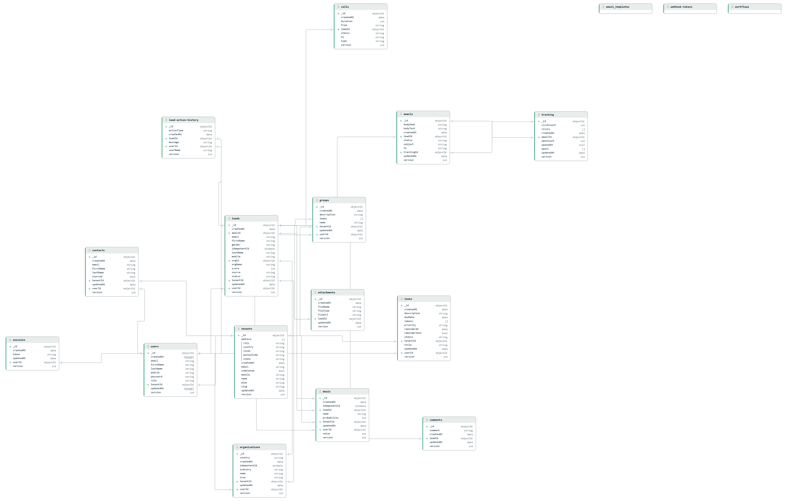

# Spark CRM

Spark CRM is a full-stack Customer Relationship Management application designed to help teams manage leads, deals, organizations, and contacts in one place. It supports multi-tenant architecture with role-based access control, enabling businesses to manage their sales pipeline efficiently.

## Features

- Authentication with JWT-based session management
- Lead and deal tracking with action history
- Organization and contact management
- Call logging and comments
- File attachments with cloud storage (AWS S3)
- Email notifications via SMTP
- CSV and XLSX data import/export
- Admin dashboard with tenant management
- Role-based access control (admin, manager, user)
- Multi-tenant support
- Background job processing with worker queues (AWS SQS)
- Scheduled jobs and automation
- Keyboard shortcuts
- AI-powered features via LangChain (Google Gemini + Tavily search)
- Image processing for attachments

## DB Schema

## Tech Stack

### Frontend

| Technology | Version | Purpose |
|---|---|---|
| React | 19 | UI framework |
| TypeScript | ~5.9 | Type safety |
| Vite | 7 | Build tool & dev server |
| Tailwind CSS | v4 | Utility-first styling |
| shadcn/ui + Radix UI | latest | Component library |
| TanStack Query | v5 | Server state & data fetching |
| TanStack Table | v8 | Data tables |
| TanStack Hotkeys | latest | Keyboard shortcuts |
| React Router | v7 | Client-side routing |
| React Hook Form + Zod | latest | Form handling & validation |
| Axios | latest | HTTP client |
| Lucide React | latest | Icons |
| date-fns | v4 | Date utilities |
| GridStack | v12 | Dashboard grid layout |
| Recharts | v2 | Charts & data visualization |
| react-hot-toast | latest | Toast notifications |
| react-helmet-async | latest | Document head management |
| xlsx | latest | XLSX data export |
| cmdk | latest | Command menu |
| lodash | v4 | Utility functions |
| input-otp | latest | OTP input |
| uuid | v13 | Unique ID generation |

### Backend

| Technology | Version | Purpose |
|---|---|---|
| Node.js | - | Runtime |
| Express | v5 | Web framework |
| TypeScript | 5.9 | Type safety |
| MongoDB + Mongoose | v9 | Database & ODM |
| Redis (ioredis) | v5 | Caching & session store |
| AWS S3 | SDK v3 | File attachment storage |
| AWS SQS | SDK v3 | Background job queues |
| JSON Web Tokens | v9 | Authentication |
| bcrypt | v6 | Password hashing |
| Zod | v4 | Request validation |
| Nodemailer | v8 | Email sending |
| Multer | v2 | File upload handling |
| node-cron | v4 | Scheduled jobs |
| csv-parser + csv-stringify | latest | CSV import/export |
| date-fns | v4 | Date utilities |
| Helmet + CORS | latest | Security headers |
| express-rate-limit | v8 | Rate limiting |
| Morgan | latest | HTTP request logging |
| LangChain Core | v1 | AI orchestration framework |
| LangChain Google | latest | Google Gemini LLM integration |
| LangChain Tavily | latest | AI web search tool |
| sharp | v0.34 | Image processing |
| Axios | v1 | HTTP client |
| cookie-parser | latest | Cookie handling |
| uuid | v13 | Unique ID generation |
